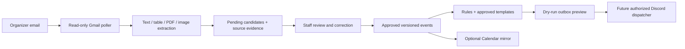

# Mathematics workflow automation: design and local prototype

The goal is **organizer email → extracted candidates → staff review → approved events → timed reminders**. Staff should review a schedule once rather than type every session or calculate every reminder time. This extends the existing Bun/TypeScript bot, using SQLite and a small background worker on the Ubuntu VPS. It does not need a new enterprise stack or Calendar as an input prerequisite.

## Scope and references inspected

Read on October 3, 2026:

- [Announcement templates](https://docs.google.com/document/d/1Gg34wJ1u1OvV0R3OBgp-dYsRj0Y6Qc5ely9I9S9wzEs/edit): Classmarker, sessions, results/Final Round qualification, email/login-details reminders, VTAMPS schedule announcements, server events, solution manuals/recordings, and competition/round-specific captions. Mathematics captions explicitly cover PhIMO, HKIMO, TIMO and BBB. Science captions are outside scope.
- The supplied [Canva short link](https://canva.link/9no7oj929d5xixj) could not be resolved with the available read methods. Connected Canva search found design `DAHUyVo4ia4`, titled MATHEMATIKAWS. Read-only text extraction shows TIMO 2026 Heat Round / VTAMPS V.25.0 sessions matching the supplied image, BBB Heat Round registration/exam dates, VTAMPS V.26.0, and unrelated pages. This is a **candidate reference**, not a verified resolution of the supplied short link; its visual layout has not been inspected. Science pages are excluded.
- User-supplied VTAMPS V.25.0 schedule image: Senior Secondary row only. The checked-in fixture is a manual transcription of this image, **not a claim of automated OCR**. Its SHA-256 is recorded. No competition or round is inferred from that image alone. Candidate Canva text suggests a TIMO relationship, but staff must confirm it before adding that relationship.

Historical fixture, Asia/Manila (UTC+8 assumed by the user's instruction):

| Session | Date | Time |
| --- | --- | --- |
| 1 | Sunday, August 30, 2026 | 5:00–7:30 PM |
| 2 | Saturday, September 12, 2026 | 5:00–7:30 PM |
| 3 | Sunday, September 13, 2026 | 5:00–7:30 PM |
| 4 | Sunday, September 20, 2026 | 5:00–7:30 PM |
| 5 | Sunday, September 27, 2026 | 5:00–7:30 PM |

These sessions are all past on October 3. They must not trigger catch-up announcements.

## What is implemented now

`src/reminders/automation/` contains a standalone SQLite approval engine and deterministic template/lead-time preview engine. `src/scripts/reminder-automation.ts` exposes a local operator CLI. It supports import, source provenance, duplicate imports, review with readable dates and before/after event data, individual correction/rejection, marking extraction incorrect, atomic approve-all/selected approval, revision checks and persistent approved snapshots. Possible pending corrections hold existing event previews until resolved. Already approved events are never overwritten by ingestion.

The prototype accepts structured extraction JSON. It does **not** yet read Gmail, OCR attachments, run an approval web dashboard, poll continuously, create persistent delivery jobs, send Discord messages, or sync Calendar. It deliberately imports no Discord client or bot configuration and only opens explicitly named `*.automation-sandbox.sqlite` files. Existing reminder code, production databases, command registration, service processes and training files are unchanged.

The local CLI assumes a trusted operator with filesystem access. Its reviewer name is an audit label, **not authentication**. Never expose it as an unauthenticated web API. The future dashboard must check staff identity and server permissions before every read and mutation.

## Runtime architecture



Start with a separate Bun worker and separate SQLite database. Share pure template/model code with the bot; do not put email network calls or OCR inside its 15-second delivery tick. Run bounded ingestion and planning jobs so attachment failures cannot block Discord commands. A single worker plus SQLite transactions is enough initially. Keep the legacy `/reminder` system usable during staged rollout; do not automatically import its manually specified send times as event dates.

Connected tools available in this session: Google Drive document reads (successfully used), Gmail profile/search/message/thread/attachment capabilities (main account profile read succeeded), and Canva search/content reads (successfully used). Two Gmail accounts are listed; only the formal/main account profile was checked, and no mailbox messages were read or changed. No callable Google Calendar tool was found in this session. Calendar is an optional integration to connect later. These interactive connectors do not supply a persistent OAuth refresh token or background worker to your VPS. Deployment needs its own Google OAuth setup and selected mailbox/calendar.

## Entities and database model

Keep the domain concepts distinct:

| Entity | Meaning / example | Important fields |
| --- | --- | --- |
| Competition | TIMO 2026 | stable ID, mathematics subject, name, year |
| Round | TIMO 2026 Heat Round | stable ID, parent competition ID, round name |
| Training program | VTAMPS V.25.0 | stable ID, program name, version |
| Preparation relationship | VTAMPS preparing for TIMO or several competitions | program/event ID, competition/round IDs, approved provenance |
| Event | Session 3, competition day, Set 2 deadline, results release | stable identity, independent type, target year level, timestamps, timezone, URLs |
| Source | organizer email and attachment | account/message/thread IDs, sender metadata, received time, content hash, page/row/cell evidence |
| Candidate / revision | newly extracted or corrected event | proposed payload, old revision, issues, confidence, approval state |
| Reminder job | one approved event/rule/version/destination occurrence | send time, immutable rendered payload, state, delivery record |
| Template / policy revision | approved text and configurable timings | type, required placeholders, lead time, anchor, destination, staff approval |
| Calendar mirror | optional approved event projection | local event ID, calendar/event IDs, mirrored revision, sync status |

There is no hardcoded universal lifecycle. Announcement, registration, training, Classmarker, login/instructions, competition, results, qualification, Final Round and materials release are independent milestone types. A qualification event can link Heat and Final rounds without assuming everyone qualifies. VTAMPS is never a Competition record. Only mathematics competitions and VTAMPS training are supported; science programs are explicitly unsupported.

Prototype schema uses `automation_batches`, `automation_drafts`, `automation_events`, and `automation_audit`. Each candidate/approved event stores a catalog snapshot so unapproved competition/round name changes cannot silently alter approved reminder wording. Each event carries `competitionId`, `roundId`, `programId`, `preparesFor`, target, type, stable slot, start/end/deadline, timezone and optional public URL/detail label. Training-session identity is program + session + target; related competitions use `preparesFor` rather than changing that identity. Competition event identity includes competition, round, milestone type and slot. Times are Unix milliseconds; display uses the source's IANA timezone.

Before production, normalize catalogs and relationships into `competitions`, `competition_rounds`, `training_programs`, `program_targets`, `events`, `event_revisions`, `sources`, `candidate_batches`, `candidate_events`, `reminder_policies`, `templates`, `reminder_jobs`, `delivery_attempts`, `calendar_mirrors`, `audit_log`, and `ingestion_cursors`. Add foreign keys, indices, revision constraints and a SQLite-aware backup plan. Keep previous approved revisions and original evidence instead of destructive overwrites. Add cancellation/status and announcement/resource records as first-class revisions; cancellation transport is not implemented in this prototype.

## Email and attachment ingestion

1. Use an explicitly chosen Gmail account, a staff-selected ingestion label/query and known organizer senders. Start with polling every few minutes; Pub/Sub is unnecessary initially. Read-only OAuth scope is enough for discovery. A label application feature would require separately authorized write scope.
2. Initial bounded sync lists message IDs and reads selected messages. Persist processed account/message IDs and a history cursor only after successful durable processing. Use Gmail history for incremental sync; if the cursor expires (HTTP 404), perform a bounded resync with deduplication. Handle pagination, outages and quota backoff. [Google's sync guide](https://developers.google.com/workspace/gmail/api/guides/sync).
3. Parse MIME body and nested attachments. Retain sender/received time/thread IDs and SHA-256 hashes. Store original bodies/attachments in a restricted private source store, separately from reminder-visible fields. Restrict attachment types, size/page counts, runtime and URL retrieval. Never automatically open arbitrary links or run macros/scripts from email.
4. Classify *both* mathematics competition milestones and VTAMPS schedules. Known aliases include TIMO, HKIMO, BBB and PhIMO; staff can add other mathematics competitions. Unknown names go to classification review, not automatic science admission. Resolve year, round and program version independently. An organizer discussing several competitions produces separate candidates and optional relationships.
5. Extract bounded plain/HTML text first, preserving table row/column relationships. For PDFs, use the repository's existing PDF library for text; render pages only when needed. For scans/images, use a constrained vision extraction provider or OCR/table adapter with a strict JSON schema. Do not flatten a table and independently guess dates/times from unrelated rows.
6. Save candidate JSON plus field-level evidence references and extraction warnings. Any model/OCR output is **untrusted data**. Emails, PDFs, Google Doc notes and Canva text cannot authorize commands, posting, OAuth changes, destination changes or approval. The extractor has no Discord send or database approval tools.
7. Notify staff of a new batch in an explicitly approved private destination once a notification transport is authorized. The eventual notification is “New VTAMPS schedule detected: 5 Senior Secondary sessions. Review?” The initial prototype only prints local output.

## Schedule interpretation and uncertainty

Locate the exact Senior Secondary row (normalize whitespace/case) and the date/day/session header columns. Bind each time cell to its column's session and date. Ignore Kindergarten/Primary/other Secondary rows. Verify count, header alignment, weekday/date agreement and end after start. Record evidence such as page 1 / Senior Secondary / Session 3 / September 13 / 5:00–7:30 PM. If labels are cut off, multiple target rows conflict, cells are merged ambiguously, or year is absent, stop that candidate for review rather than inventing a value.

Assume Asia/Manila only when the source has no explicit timezone; record that assumption as provenance. Respect explicit source zones and convert to a UTC instant without losing the original zone. Missing years, ambiguous numeric dates, conflicting day names, unknown round/version and date-only deadlines remain unresolved. Distinguish a deadline with unknown time from an all-day informational date. Never invent midnight or 11:59 PM.

Pending drafts may have null times. Approval requires complete session start/end, competition start, or deadline timestamp as appropriate, and no unresolved issue flags. Staff must explicitly resolve issue flags in the edit operation; a confidence score alone never activates events. The current fixture carries a manually assessed “high” label, not calibrated OCR accuracy. Source email content is not copied into public messages. Login reminders say to check email; they never publish credentials or individualized links.

## Duplicate and correction rules

- Same account/message/attachment hash: idempotent import. A different parse of the same source is rejected in favor of editing its existing review.
- New forwarded email with identical event/catalog: retained as evidence but marked unchanged; no second event or hold.
- Stable event identity excludes date/time. Session 4 moving to another day updates the same approved event after review. The UI shows old vs proposed times/source and can approve only that correction.
- Pending changed candidates conservatively hold planning for that event. Other events continue. Rejecting/marking incorrect removes the hold; approval installs a new revision atomically.
- Competing approvals use the candidate's base revision. A stale review cannot overwrite a more recently approved event. Reject the stale proposal or ingest a new source revision based on current evidence.
- Fuzzy competition/session matching proposes possible matches for staff; it must not automatically merge different rounds/versions. Stable catalog IDs must be resolved before import. The prototype does not implement fuzzy name resolution.
- Older organizer emails do not win merely because they were ingested later. Compare received/sent dates, explicit “revised” wording, authority and source evidence. Contradictory organizers remain held for human choice. Missing events in a later email do not imply cancellation.

## Templates and reminder policies

Use the Google Doc as the editorial source and import **versioned approved templates**; do not fetch mutable Google Doc text on every send. Edits to the doc should propose a template diff for staff approval. The four prototype templates preserve session, Classmarker, email and server-event wording while converting bracketed placeholders into named placeholders. They add explicit timezone context when rendering times. Others need structured authoring before activation:

- Results/qualification: preserve the doc's celebration caption, but require explicit result and advancement facts. Do not automatically announce that all medalists qualified without verified source evidence.
- Schedule announcement: require an approved schedule attachment and version, not merely a URL substituted for the doc's attachment instruction.
- Recordings/solution manuals: model a collection of session-numbered video/manual links, with incomplete entries and later additions visible to staff. An update revises the same resource announcement and retains public/private-link classification.
- Competition announcements: select the mathematics competition and Heat/Final caption explicitly. Registration-deadline and competition-day templates not supplied as standalone messages require staff-approved text, rather than invented generic replacements.

Event types select configurable rules: rule ID, anchor (`start` or `deadline`), lead minutes, template and destination mapping. Multiple rules can produce multiple previews for an event. `preview-config.json` uses **illustrative** 24-hour session and six-hour Classmarker lead times, and fake Discord IDs, not staff policy or real destinations. Role/channel mappings belong to staff configuration, never extraction output. Unresolved template fields fail closed. Explicit `allowedMentions` permits only the configured role; pasted everyone/user/other-role text cannot cause additional pings. [Discord's message API](https://github.com/discord/discord-api-docs/blob/main/developers/resources/message.mdx).

The current CLI receives one destination configuration per preview. Before production, add competition/round/target-specific routing and version policies/templates; changes must re-plan pending jobs and leave sent history intact. The engine evaluates each milestone independently rather than assuming every competition has training or a Final Round.

## Approval dashboard and eventual delivery

Build a small staff-only web page showing source excerpt/image crop beside the candidates. Summary separates competition/round from program/version and highlights timezone assumptions, missing values, past events, duplicate matches and changed fields. Actions: approve all valid candidates, select/edit/reject, mark extraction incorrect, confirm identity/link relationships, or resolve conflicts. Escape all source text/URLs. Use Discord OAuth plus guild staff permission checks, session cookies, CSRF protection and optimistic revision tokens. No approval through an email instruction or an AI tool decision. Sensitive source access should be narrower than access to public reminders.

Dry-run outbox shows exact wording, send instant, local timestamp, channel, allowed role and source/approval revision. The current preview is read-only and can be repeated; it does not claim jobs or record delivery. There is no real posting switch in this prototype.

For later live posting, persist immutable jobs uniquely by `(event ID, approved revision, policy revision, rule ID, guild, channel)`, supersede unsent jobs when an event changes, and re-check the approved revision and holds under a transaction before claiming. Reserve each job durably before contacting Discord. Revalidate channel/guild/permissions/role at send time. Cancelled or past events never send; elapsed reminder times are skipped unless staff explicitly approves a catch-up announcement. Preview configuration alone does not prove live permissions.

Reuse the existing reminder scheduler's cautious delivery approach: errors or crashes around a send remain uncertain/delivering, with no automatic resend until staff reconciles Discord. Stable nonce enforcement reduces transport duplicates but cannot provide permanent exactly-once delivery. If a claimed job races a correction, record that the send might already be in flight and require staff to decide whether a correction announcement is needed. Do not promise that a database update can recall an in-flight message. Apply rate limits and surface blocked/uncertain jobs privately rather than silently losing them.

## Optional Calendar output

After approval, mirror chosen events to a dedicated calendar, keeping local event ID and approved revision in private extended properties plus a local Calendar event-ID mapping. Create/update the same mirrored event for a correction. Sync failure does not invalidate approved reminders. Mark superseded/cancelled events explicitly once cancellation is implemented. Do not attach attendees or send invitations by default. Avoid publishing credential-bearing source attachments or links. Start one-way; Calendar edits should become reviewed candidates before they can affect the internal system. [Calendar extended properties](https://developers.google.com/workspace/calendar/api/guides/extended-properties).

## Local use

From the repository on Ubuntu/WSL with the pinned Bun runtime on PATH:

```sh
bun src/scripts/reminder-automation.ts import /tmp/demo.automation-sandbox.sqlite docs/examples/reminder-automation/vtamps-v25-0.json
# Copy the returned batch ID; review never activates events.
bun src/scripts/reminder-automation.ts review /tmp/demo.automation-sandbox.sqlite BATCH_ID
# Approve all pending candidates, or append individual candidate IDs.
bun src/scripts/reminder-automation.ts approve /tmp/demo.automation-sandbox.sqlite BATCH_ID reviewer-name
bun src/scripts/reminder-automation.ts preview /tmp/demo.automation-sandbox.sqlite docs/examples/reminder-automation/preview-config.json
# Historical simulation only: this clock does not affect stored approvals or send anything.
bun src/scripts/reminder-automation.ts preview /tmp/demo.automation-sandbox.sqlite docs/examples/reminder-automation/preview-config.json 2026-08-01T00:00:00+08:00
```

PowerShell can invoke the same CLI using a Windows-compatible Bun version with `node:sqlite`, or the repository's pinned WSL Bun. Do not use the older Windows Bun 1.3.14 runtime for SQLite validation. Use explicit sandbox storage, never the legacy reminder database.

`edit DB BATCH CANDIDATE correction.json REVIEWER` accepts `{ "event": <complete corrected event>, "issues": [] }`; clearing issues is an explicit reviewer action. Event identity edits require rejection and a new import. `reject DB BATCH REVIEWER [CANDIDATE ...]` rejects selected/all pending candidates. `incorrect DB BATCH REVIEWER` marks all pending candidates as incorrect. No live test is performed by these commands.

## Failure behavior and stages

| Failure | Required behavior |
| --- | --- |
| Wrong OCR or ambiguous header | Pending issue, evidence preview, staff correction; no activation |
| Date-only deadline | Store null time and issue; approval blocked until confirmed |
| Wrong year level | Exclude other rows; exact target required |
| Unknown mathematics competition | Classification/alias review; no invented catalog match |
| Changed schedule | Same stable identity, proposed revision, hold unsent reminders |
| Duplicate/forwarded emails | Durable source dedup and unchanged-event detection |
| Conflict or stale approval | Hold/revision error; human resolution |
| Past events / overdue lead time | Historical record or skipped preview; no catch-up burst |
| Missing link/template/destination | Block affected preview/job, retain evidence |
| Email/provider outage | Bounded retries, persisted cursor, staff health signal |
| Discord error after possible send | Uncertain delivery, manual reconciliation, no automatic retry |
| Private credentials or injected instructions | Restricted source storage; no source-authorized actions |
| Calendar failure | Retry mirror separately, leave internal approval/reminder state intact |

1. **Implemented foundation:** isolated storage, entity distinction, review/edit/reject/approval, updates, deterministic templates, fixture and dry-run CLI. Validate locally before integration.
2. **Email ingestion and extraction:** selected mailbox OAuth, label/query/organizer rules, bounded source store, Gmail cursor, MIME/PDF/image adapters, field evidence and classification tests from redacted organizer examples. Never require staff to retype all sessions.
3. **Review UI and policy administration:** staff authentication, source/candidate comparisons, per-competition routing, approved template versions and custom timings. Retain draft-only behavior.
4. **Persistent dry-run worker:** job planner, revision invalidation, expiry/cancellation, health reporting and private previews. Run on VPS with no send capability and review real candidate accuracy.
5. **Authorized Discord rollout:** only after staff approves concrete channels/roles/templates and evidence from dry-run operation. Test channel/no role first, then controlled role checks; deploy/register/restart only when separately authorized. Preserve existing legacy reminder data.
6. **Optional Calendar mirror:** dedicated calendar OAuth and one-way revision mapping. It never becomes a manual schedule-entry requirement.

Outstanding prerequisites are the exact Canva reference confirmation, selected organizer-mailbox scope, canonical competition aliases/year-round identities, real destination/role mappings, approved timing policies, authentication and long-running OAuth setup. No external writes, announcements or deployment were performed.

## Local validation evidence

October 3, 2026, pinned WSL Bun 1.4.2: all 293 Bun tests passed, including eight new automation tests; TypeScript check and build passed; all four Python math tests passed. The actual CLI was exercised against a temporary database: import/review found five candidates, preview before approval was empty, fixture approval activated five historical events, current-date preview skipped all five, and an August 1 historical simulation produced five planned reminders using the document's session wording. The temporary database was removed. No live Gmail ingestion, OCR, Discord posting, Calendar sync or VPS deployment was validated.
