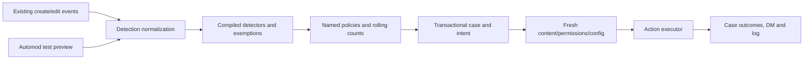

# Aleph moderation/security phase 1 — October 4, 2026

## Repository map and reuse

Inspection preceded implementation. Base: `cd1479d` on `codex/audit-aleph-development`; feature branch: `codex/moderation-security-phase1`. Initial unrelated work includes five tracked Aleph training edits and the reminder-automation prototype (documentation, source, tests and examples). Eighteen protected files, including service backups, were hashed before changes and excluded from this feature.

The Discord gateway in `src/index.ts` invokes moderation before study handling and handles edits separately. Commands share the registry in `src/commands/index.ts`; registration is manual. The authenticated study service owns AI jobs and legacy filter rules/audit. MPoTD/practice, reminders and admin stores are independent SQLite systems. Their event handlers and stores remain intact.

Reuse: event ordering, command registry, ephemeral replies, Bun/SQLite conventions and synthetic tests. New authorization uses the **actual guild owner** and configured security-admin roles. Manage Messages allows status/test/case reads, but does not grant security changes. Only the owner can edit security-admin roles. Existing hardcoded creator/moderator roles and AI tester admission do not bypass these checks.

New storage is excluded from `/sql`, including canonical-path aliases. Legacy `/filter` owns disabled guilds and continues during shadow evaluation. Enforce mode gives the new engine sole ownership of message moderation for that guild; translate legacy rules explicitly before switching. Old rules are never copied/deleted automatically. Discord AutoMod remains independently configured and untouched.

## Research and API limits

[Protector documentation](https://protector-bot.com/docs?lang=en) describes protected owner/security-role configuration, persistent protection state and permission diagnostics. These inform the design; no code, branding or global blacklist is copied.

[Sapphire's official site](https://sapph.xyz/) describes configurable modules, conditional punishments, cases and DM customization. Its linked docs rendered no readable content here, and the exact NTTS setup could not be verified. The user's supplied requirements govern behavior; no exact NTTS word list, threshold or configuration is claimed.

[Discord AutoMod](https://support.discord.com/hc/en-us/articles/4421269296535-AutoMod-FAQ) can block messages before posting. Aleph observes posted gateway messages and cannot promise the same pre-send blocking. Diagnostics report enabled built-in rules, not complete threat coverage.

[Audit logs](https://docs.discord.com/developers/resources/audit-log) require View Audit Log, retain entries for 45 days and can have null actor/target fields. The correlation helper requires an exact action/target/time match and refuses missing/ambiguous actors. It is tested groundwork only; no live anti-nuke sanctions are installed.

[Discord permissions](https://docs.discord.com/developers/topics/permissions), [guild operations](https://docs.discord.com/developers/resources/guild#modify-guild-member) and [intents](https://docs.discord.com/developers/events/gateway#privileged-intents) constrain protection. Owners/administrators cannot be timed out; role hierarchy and managed roles limit quarantine. Future join/profile monitoring needs reviewed member-event intents. Available names can be inspected; general bio/about-me is not supplied by the current bot lookup. Restoration cannot preserve deleted IDs, original authorship or every setting.

## Modules and storage

`src/security/` separates `types`, `normalization`, `config`, `detectors`, `store`, `actions`, `runtime`, `authorization`, `diagnostic` and `attribution`. Detectors return structured findings; policies own punishment/rolling windows; no detector calls Discord sanctions. The Discord adapter rechecks current state immediately before dispatch.

Separate **moderation schema v1**, created transactionally when its store opens:

| Table | Purpose |
| --- | --- |
| `security_config` | Current guild config/revision |
| `security_config_versions` | Actor, timestamp and complete versioned config |
| `security_cases` | ID, guild/member/event/source, origin, actor/reason, findings and decision snapshot |
| `security_infractions` | One infraction per member/source/event with policy/expiry |
| `security_case_events` | Append-only detection/action/notification outcomes |
| `security_actions` | Unique case/action reservations, results and uncertainty |

No existing database schema changes. Unrelated databases are refused. Case/audit update/delete triggers preserve history. Current producers create automatic cases; the origin field accommodates later manual moderation. Expired infractions stop counting but remain in audit history. Manual warning/reversal and retention-purge commands are deferred.

## Implemented behavior

Defaults: global engine disabled, server mode disabled, no rules, soft/medium policy templates, no default timeout/kick/ban. The example is synthetic and starts in shadow mode; it is not loaded automatically.

Detectors support Unicode-aware literal whole words/phrases, constrained regex and exact domain/subdomain matching with IDN canonicalization. No links are fetched. NFKC/case/zero-width normalization changes detection strings only; original messages remain intact. A limited Latin-lookalike skeleton and spacing variants require rule opt-in and are **always review-only**. No non-English rule exists. Profile-source input is supported in preview and is review-only; live profile monitoring is deferred.

Regex subset: no groups, alternation, backreferences, `*`, `+` or multiple quantified atoms; one optional atom or bounded repetition up to 32. Unsupported patterns are rejected rather than run in an untrusted regex engine. Limits: 100 rules, 20 policies, 200 total patterns, 16,000 input characters; compiled config cache is revision-aware and bounded to 100 guilds.

Exemptions apply globally/per rule for users, roles, channels, thread parents and categories. Default staff bypass covers Manage Messages and the guild owner; trusted/staff/ticket/report IDs must be explicitly configured. Bot/webhook messages await dedicated protection modules.

Policies control deletion, counting, windows/expiry and ordered reminder/warn/optional-timeout steps. Multiple findings create one chosen policy infraction per message. The default medium template reminds then warns with illustrative seven-day rolling/30-day expiry settings; these are configurable, not a claimed NTTS recipe. Explicit timeout steps support at most 28 days with fresh eligibility/hierarchy checks. There are no kick/ban executors in phase 1.

Duplicates reuse a case; edits create explainable new cases without another infraction or repeated escalation for the same message. Counts use time read under the SQLite write lock. Shadow cases/previews do not count. A persisted per-user/per-guild one-minute dispatch budget bounds Discord actions; it is not yet a spam detector. Case and configuration reads use indexed/bounded queries.

Before acting, re-fetch content, member/roles and configuration. Changed content/config or exemption denies the saved action. Reserve each side effect before sending. Definitive rejection is failed; network/5xx or a crash may be uncertain. Reserved/uncertain actions never automatically retry; reconciliation commands are deferred. Cases retain bounded matched evidence/variant and policy snapshots, not complete original message bodies. DM/log outcomes are explicit; no configured log channel is recorded as skipped. Failure to notify/log does not repeat a sanction. Blocked-content decisions suppress study replies even when deletion fails.

## Commands and config

Added definitions, not registered:

- `/automod status`: mode/revision/rule summary and full config attachment.
- `/automod test text:... [source:message|profile] [user:...]`: no writes/actions. Synthetic non-staff preview by default; optional real member uses fresh exemptions. Channel/category exemptions apply. Reports the first-violation decision, not rolling escalation prediction.
- `/automod configure json:... confirm:true`: validated complete replacement, owner/security authorization and revision check.
- `/automod cases [case:ID] [user:...]`: bounded guild-scoped case history or a case plus all outcomes, ephemeral.
- `/protection status` and `/protection diagnostic`: operational/degraded/unavailable/not-implemented distinctions; bot permissions/hierarchy and enabled Discord AutoMod inspection when allowed.

Config: [example](../examples/security-phase1.json). Example environment files add `MODERATION_ENGINE_ENABLED=false` and a separate `MODERATION_DB_PATH`; secret files are unchanged. Complete command JSON is capped at 6,000 characters; larger imports/rule-management commands are deferred. Default command visibility requires Manage Messages; security roles without it need deliberate command-access overrides. Runtime authorization still applies.

The registry can later add `/mod`, `/infractions`, `/cases` and MPoTD status/inspect/submissions without changing engine contracts. No private MPoTD submissions are newly exposed.

## Next phases

| Phase | Deliverable | Conditions |
| --- | --- | --- |
| 1 (this change) | Cases, normalization/detectors, policy separation, exemptions, rolling counts, actions, commands, diagnostics | Local/mock tests; authorized test-guild shadow evaluation |
| 2 | Spam/duplicate/mention/flood windows, coordinated accounts, reviewed invite/phishing rules, profile review | Bounded state, multilingual false-positive corpus and moderator feedback |
| 3 | Raid/join/account-age state, attributed destructive events, webhook/bot monitoring and owner-approved quarantine | Member/audit intents, thresholds over windows, role hierarchy, precise attribution |
| 4 | Versioned structural snapshots, retention, dry-run restore and confirmed recovery | Supported fields only, replacement-ID mapping, partial/impossible reporting and strong authorization |

Ordinary single admin actions must remain nonpunitive. Quarantine should persist original manageable roles and who added/approved the bot; unknown attribution or unmanageable roles causes review/diagnostic. Future snapshots should retain bounded versioned manifests/hashes for channels/categories/roles/overwrites and supported settings with configurable count/age retention. Restore confirmation must bind the reviewed plan hash, guild, actor and expiry; resolve replacement IDs before overwrites and explicitly label incomplete recovery. These are designs, not installed capabilities.

## Validation and manual rollout

Baseline before edits: 293 Bun tests, typecheck and build passed. New isolated tests cover normalization/false positives, exemptions, regex bounds, domain parsing, rolling counts, duplication/edits, restart/concurrency, rate limits, action/permission/notification failures, raw-SQL isolation, protected authorization, diagnostic truthfulness and audit attribution. Discord adapter tests use mocked fresh fetches.

Final evidence: **326/326 Bun tests across 30 files**, including **33 new security regressions**; **4/4 Python tests**; typecheck, build and scoped diff checks passed. The missing-member-cache regression verifies that a fresh member fetch is performed rather than bypassing moderation. All eighteen protected-file hashes still match the pre-change baseline. Existing tests were retained without weakening or deletion.

Changed files: ten new `src/security/*.ts` modules; new `src/commands/automod.ts` and `src/commands/protection.ts`; existing `src/commands/index.ts`, `src/index.ts`, `src/moderation.ts`, `src/config.ts`, `src/admin/sql.ts`; new `tests/security.test.ts`, `tests/security-runtime.test.ts`, `examples/security-phase1.json` and this runbook; README and the two bot environment **example** files. No existing tests, training files, reminder prototype files or secret environment files were changed by this feature.

No production data, secrets, deployment, registration, PM2 restart, main merge or dataset generation is performed. Review the final diff/results before authorizing rollout. Then back up persistent stores, verify separate new storage, retain Discord AutoMod, manually register definitions in a test guild, enable required intents/message features, configure shadow rules/exemptions/logging and review cases before enforcement. Translate legacy filters explicitly before switching enforcement.

Detection needs View Channel/message intents; deletion needs Manage Messages; timeouts need Moderate Members and hierarchy; logging needs a same-guild sendable channel and Send Messages. DMs may fail. Audit/role/channel/webhook/kick/ban permissions are diagnostics for later modules, not installed detectors. Follow the existing `/opt/math-bot` PM2 procedure only after approval. Live Discord behavior and real server rules remain unverified.
